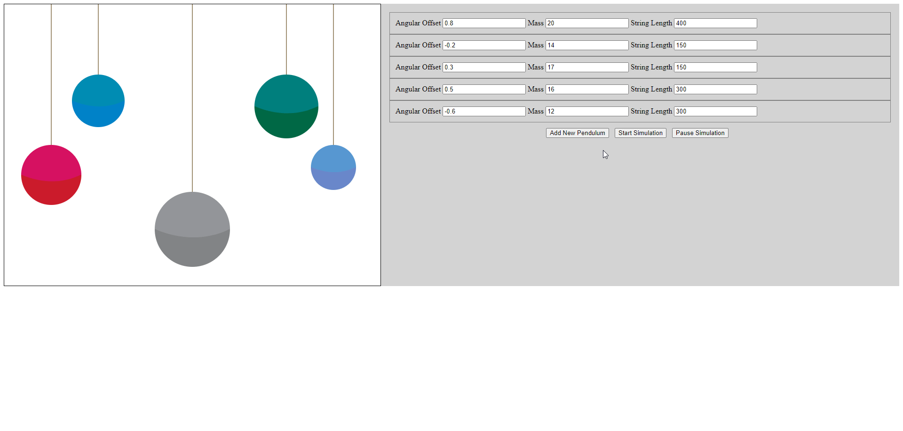

# simple-pendulum


<!-- ABOUT THE PROJECT -->
## About The Project

This project features a simple pendulum simulation. It visually displays as many as 5 pendulums concurrently. It offers a UI with the configurable options: angular offset, mass, and string length.

This monolith project is composed of two executable sub-projects:
- UI
    - Built in TypeScript using Webpack
- Backend
    - Built in Node.js using Express




## Getting Started

1. Clone the repo
   ```sh
   git clone https://github.com/RobRuff/simple-pendulum.git
   ```
2. Install NPM packages from both projects
   ```sh
   cd src/frontend
   npm install
   ```

   ```sh
   cd src/backend
   npm install
   ```
4. You can execute all servers from the project root
   ```sh
   npm start
   ```

## API Documentation

### POST /configPendulum
| Request Field    | Field Type |
| --------         | -------    |
| angular offset   | number     |
| mass             | number     |
| string length    | number     |

| Response Field   | Field Type |
| --------         | -------    |
| status           | 200        |

### GET /getPendulumAngle

| Response Field   | Field Type |
| --------         | -------    |
| angle            | number     |
